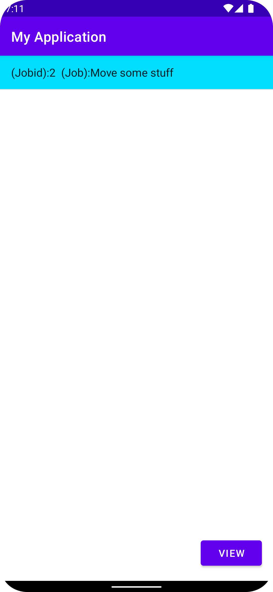
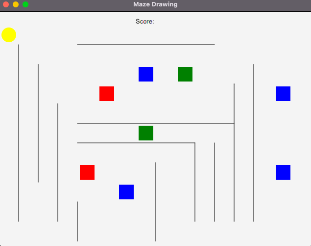
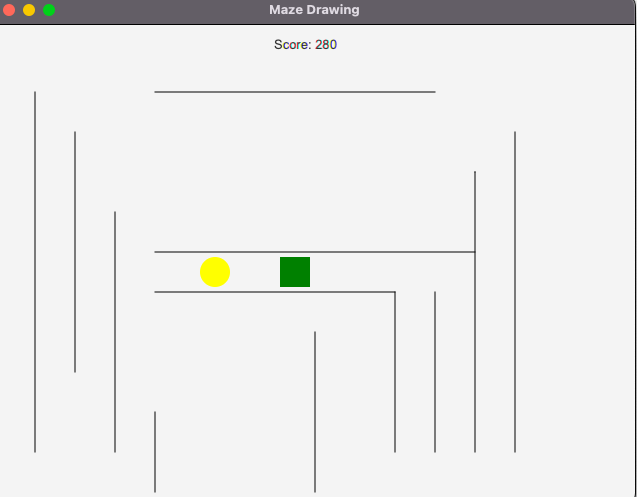
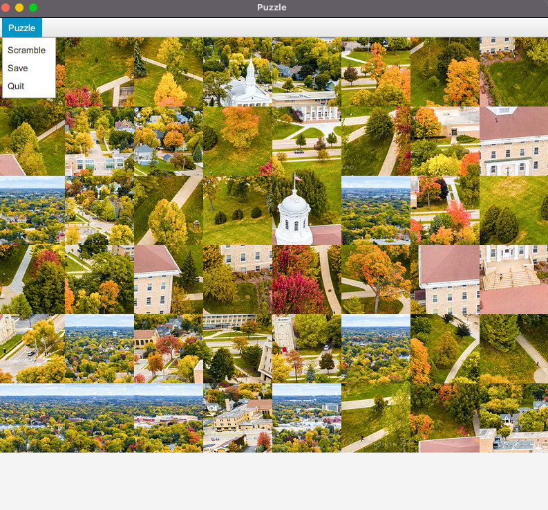
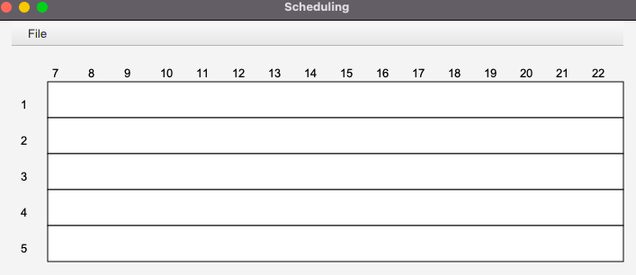
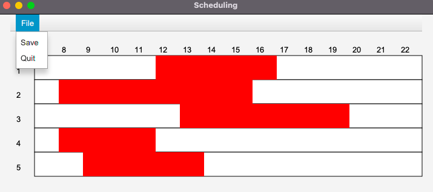
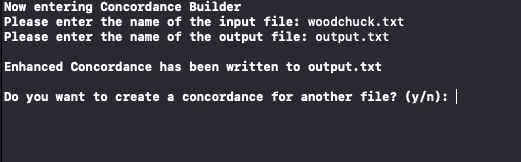
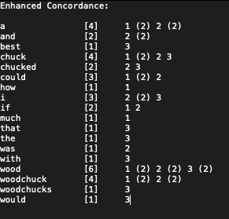
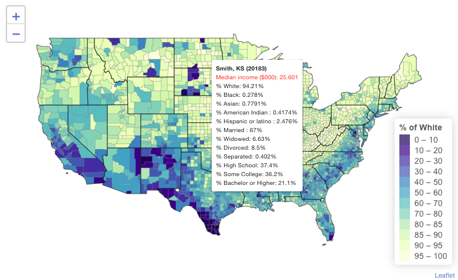
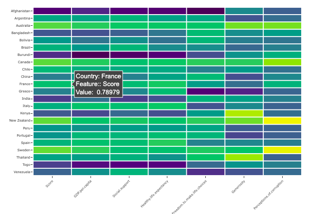

My Projects of both Data Science and Computer are shown below. The link for the github repos are given.(Click the Project name)

## Computer Science Project 
### [Project 1: The Famous Wordle Game in JavaFX](https://github.com/munimn/wordlegamejavafx) 

- Use of JavaFX and extensive use of inputs from user
- Use of Searching from dictionary of words in less time.
- The game is mirroring the wordle game online where it gives you 5 chances to guess a 5 letter word of the day. 

### [Project 2: A task management android app](https://github.com/munimn/Android_task_management_app) 

- A simple task management app using springboot and java 
- You can login to your id and then post a job or see available jobs for you. 
- As an user you can give ratings to workers who have completed jobs for you . You can also add the hours it took to complete the job

### [Project 3: A maze treasure hunt game](https://github.com/munimn/Treasure-hunt-game-with-javafx) 

- A JavaFX game where you can use the keyboard arrows and play around the maze to collect treasures
- The game is built using java and javaFX. 
- Each of the treasures are of different points and the game ends when all the treasures are collected. 

### [Project 4: A Picture Puzzle](https://github.com/munimn/Picture-Puzzle-javafx) 

- A picture puzzle game where you can move the tiles and solve the puzzle 
- There is also a dropdown menu to scramble the puzzle or save
- This game was built with javafx, java and using the sceneBuilder

### [Project 5: A Room Scheduling Scene](https://github.com/munimn/Simple-Scheduling-javafx) 

- A simple room reserving javaFX project 
- There are 5 rooms and the available times where you can press the enter key and then drag the red box to the room and time you want to reserve it for 
- There is a dropdown menu to save your reservations

### [Project 6: A Concordance project](https://github.com/munimn/concordance) 

- Built a concordance where you can input a text file and get the concordance of the text in the file 
- Used sets and maps as Data Structures for fast searching 
- The time complexity is O(log(n)) 

## Data Science Projects
### [Project 1: A research project on ACS Data](https://munimn.github.io/researchprojectdata/)

- Data obtained from the 2020 ACS 5-Year via the **tidycensus package**.
- **Big Data** cleaning, tidying, joining, manipulating, and feature engineering
- Using Leaflet.js
- Creating Interactive U.S Maps
- Simpe Linear Regression , Multiple Linear Regression
- Using Fixed Effects 
- A deep inference and understanding about the results obtained from the models

### [Project 2: World Happiness Score prediction](https://munimn.github.io/Worldhappiness/Final_Project_CMSC208--1-.html)

- Data obtained from Kaggle 
- Use of Different Predictive models 
- Using Recipe package of R language 
- Creating Interactive Graphs
- Inference about the best predictive model 

### [Project 3: Bookdown - R, SQL, Web Scraping](https://github.com/munimn/Rcookbook) 

- Introduction and Intermediate **R**  
- Introduction to the **Tidyverse**, Data Visualization with **ggplot2** 
- Categorical & Quantitative Data
- Cleaning, Joining and Data Manipulation(Basic Feature Engieering)
- Introduction to **SQL**
- Joining Data in **SQL**
- Web Scraping in **R**
- Simpe Linear Regression , Multiple Linear Regression
- Dummy Variable, Fixed Effects, Difference-in-Differences

### [Project 4: Bookdown - Data Science in Python](https://github.com/munimn/machinelearningPythoncookbook) 

- Introduction to Data Science in Python
- Introduction to Matplotlib for graphs and plots
- Introduction to Numpy, Scikit-Learn and Pandas
- Creating basic predictive based models in python
- Regression models, Knn classifier , Random Forest models 
- A small project using feature engineering, data analysis, and building model to see best performance

### [Project 5: Heart Disease Exploration using R](https://munimn.github.io/HeartDisease/) 

- An analysis on Heart Peak rate and Cholesterol level 
- Data taken from UCI ML Repository
- A well written academic analysis on the issue
- Use of MLR , SlR and basic data exploratory analysis with data cleaning 

