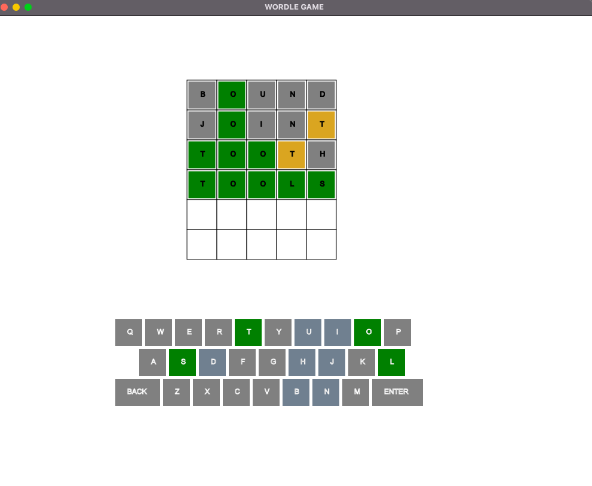
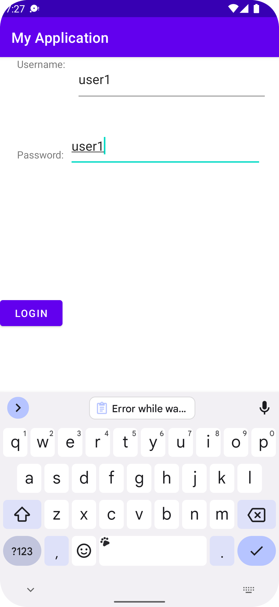
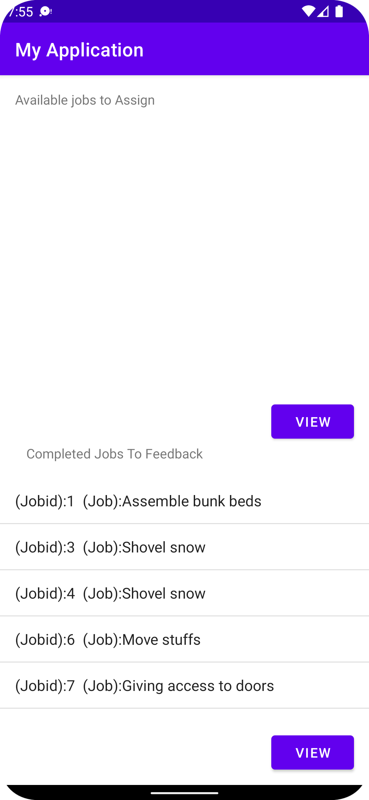
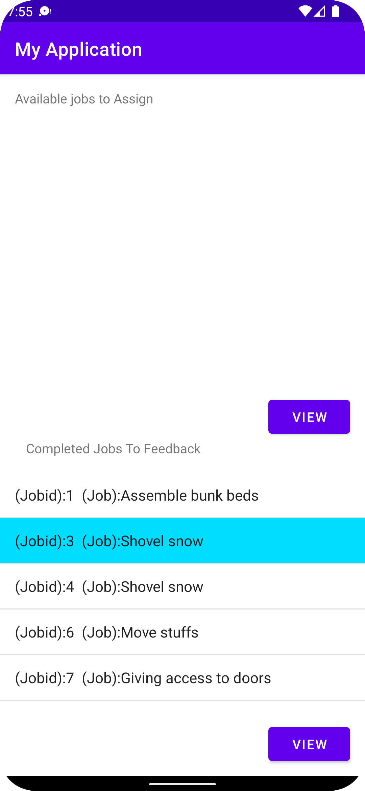
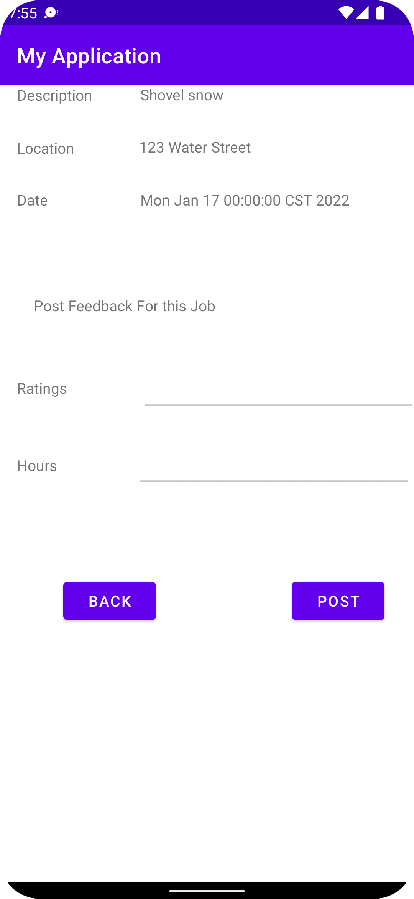
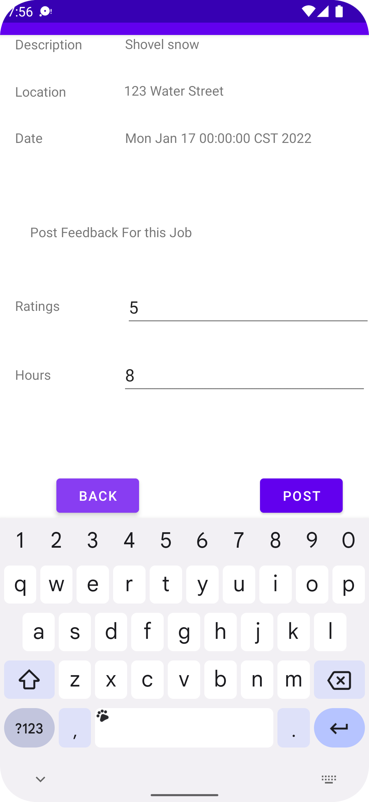
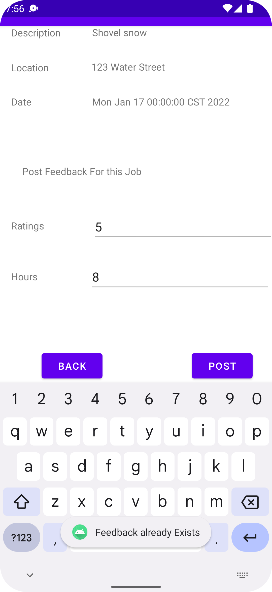

My Projects of both Data Science and Computer are shown below. The link for the github repos are given. 
## Computer Science Project 
### [Project 1: The Famous Wordle Game in JavaFX](https://github.com/munimn/wordlegamejavafx) 

- Use of JavaFX and extensive use of inputs from user
- Use of Searching from dictionary of words in less time.
- The game is mirroring the wordle game online where it gives you 5 chances to guess a 5 letter word of the day. 

### [Project 2: A task management android app](https://github.com/munimn/Android_task_management_app) 

- A simple task management app using springboot and java 
- You can login to your id and then post a job or see available jobs for you. 
- As an user you can give ratings to workers who have completed jobs for you . You can also add the hours it took to complete the job

